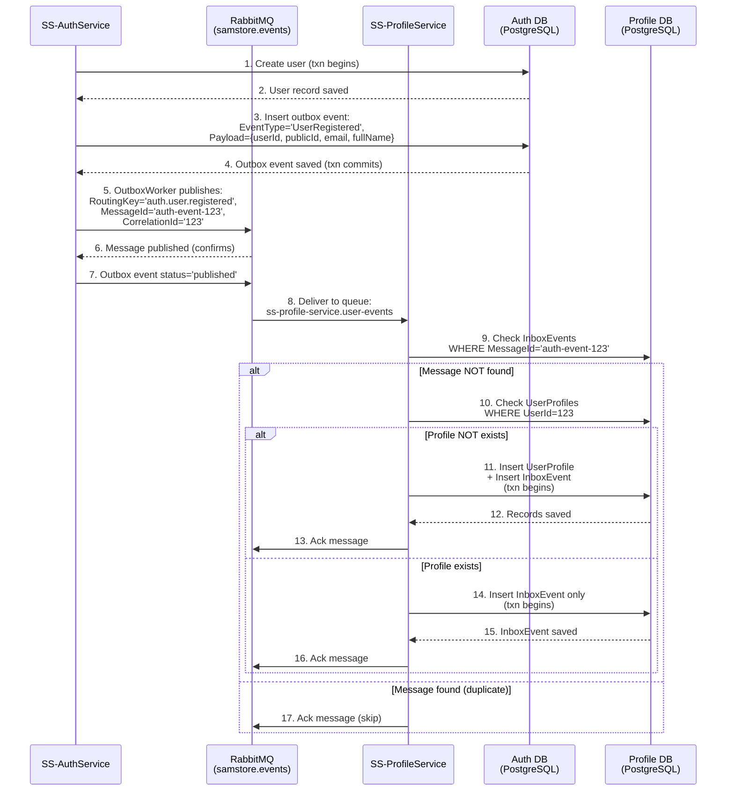

# Integration with SS-AuthService

## Overview
SS-ProfileService needs to integrate with SS-AuthService to automatically provision user profiles upon user registration and verification.

## Event-Driven Architecture
We will use an event-driven choreography pattern. When a user registers or verifies their email, SS-AuthService publishes a message to RabbitMQ, which SS-ProfileService consumes to create a base profile.

## Events to Consume

### UserRegistered
- **Routing Key:** `auth.user.registered`
- **Exchange:** `samstore.events` (Topic)
- **Payload:**
  ```json
  {
    "userId": 123,
    "publicId": "guid-here",
    "email": "user@example.com",
    "fullName": "Full Name"
  }
  ```

### UserVerified
- **Routing Key:** `auth.user.verified`
- **Exchange:** `samstore.events` (Topic)
- **Payload:**
  ```json
  {
    "userId": 123,
    "publicId": "guid-here",
    "email": "user@example.com"
  }
  ```

## Integration Flow



## Implementation Plan

### 1. RabbitMQ Subscriber
Create a background worker (`UserEventConsumerWorker` inheriting from `BackgroundService`) in SS-ProfileService to subscribe to `samstore.events` and bind a private queue (e.g., `ss-profile-service.auth-events`).

### 2. Idempotent Processing (Inbox Pattern)
To prevent duplicate processing due to RabbitMQ redelivery, implement the **Inbox Pattern** using the existing `InboxEvents` table in the database:
- On event receipt, extract the message ID.
- Begin an ACID transaction with the DbContext.
- Check if the message ID exists in the `InboxEvents` table.
- If it exists, acknowledge the message and skip processing.
- If it does not exist, insert the `InboxEvent` record marking it as `PROCESSED`.
- Check if a profile already exists for the given `UserId`. If not, create a base `UserProfile` using the `fullName`, `userId`, and `userPublicId` from the payload.
- Commit the transaction and acknowledge (ACK) the message to RabbitMQ.

## Configuration Requirements
Add the following to `appsettings.json` in `SS.ProfileService.API`:
```json
{
  "RabbitMQ": {
    "Host": "host.docker.internal",
    "Port": 5672,
    "QueueName": "ss-profile-service.auth-events"
  }
}
```